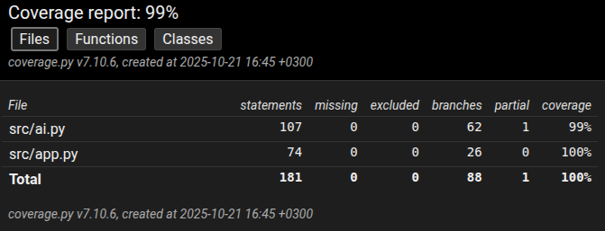

# Testausdokumentti

## Yksikkötestaus

Yksikkötestaus on tehty Unitest-kirjastoa käyttäen. Testeissä testataan luokkien Connect4 ja AI toimintoja, sillä nämä sisältävät ohjelmalogiikan funktioita. Käyttöliittymä ei ole mukana testauksessa.

Testauksessa syötteinä on käytetty pelilaudan eri tilanteita: tyhjää lautaa, täyttä lautaa sekä erilaisia osin täytettyjä lautoja.

## Testikattavuus

